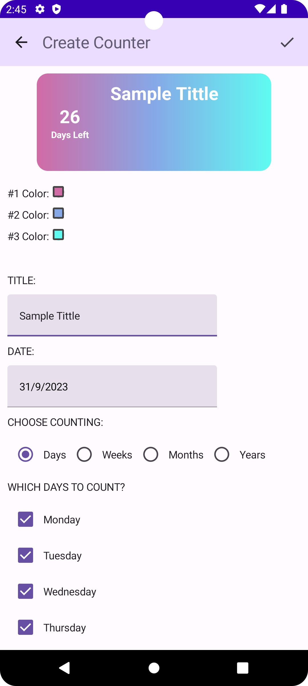

# Simple Days Counter

A simple Android app to store and remind you of important dates in your life.
Just enter a date and the app will display the time until that date.

## Features

You can select dates for upcoming events as well as those that have already occurred.

Available time conversion to pick:

- days
- weeks
- months
- years

By selecting time conversion of days you can specify which days of the week should be counted and
which should not.

You can also customize the color of your event counter background using available color picker.

Last but not least, give the event counter a unique name.

## Preview:

  

## Requirements

- Android 8.0+ ([API 26](https://developer.android.com/studio/releases/platforms#8.0))

## Built with

- [Kotlin](https://kotlinlang.org/) - programming language
- [Jetpack Compose](https://developer.android.com/jetpack/compose) - toolkit for building native UI
- [Room](https://developer.android.com/training/data-storage/room) - library provides an abstraction
  layer over SQLite for database access.
- [Colorpicker](https://github.com/skydoves/colorpicker-compose) - color picker library
